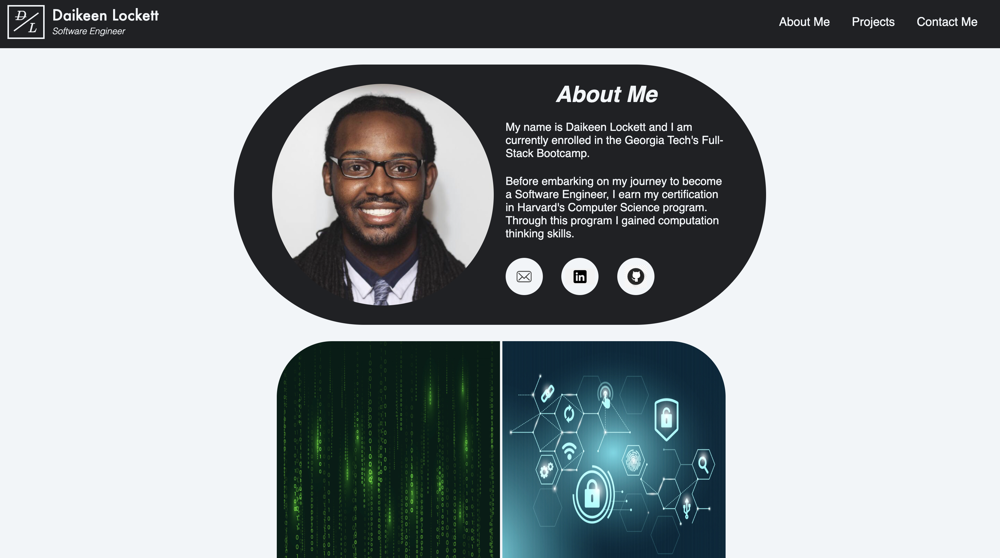
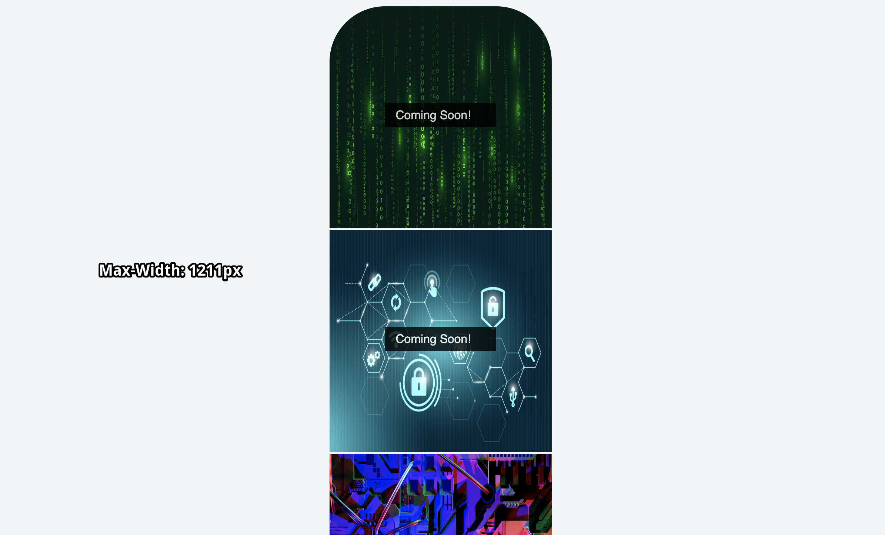
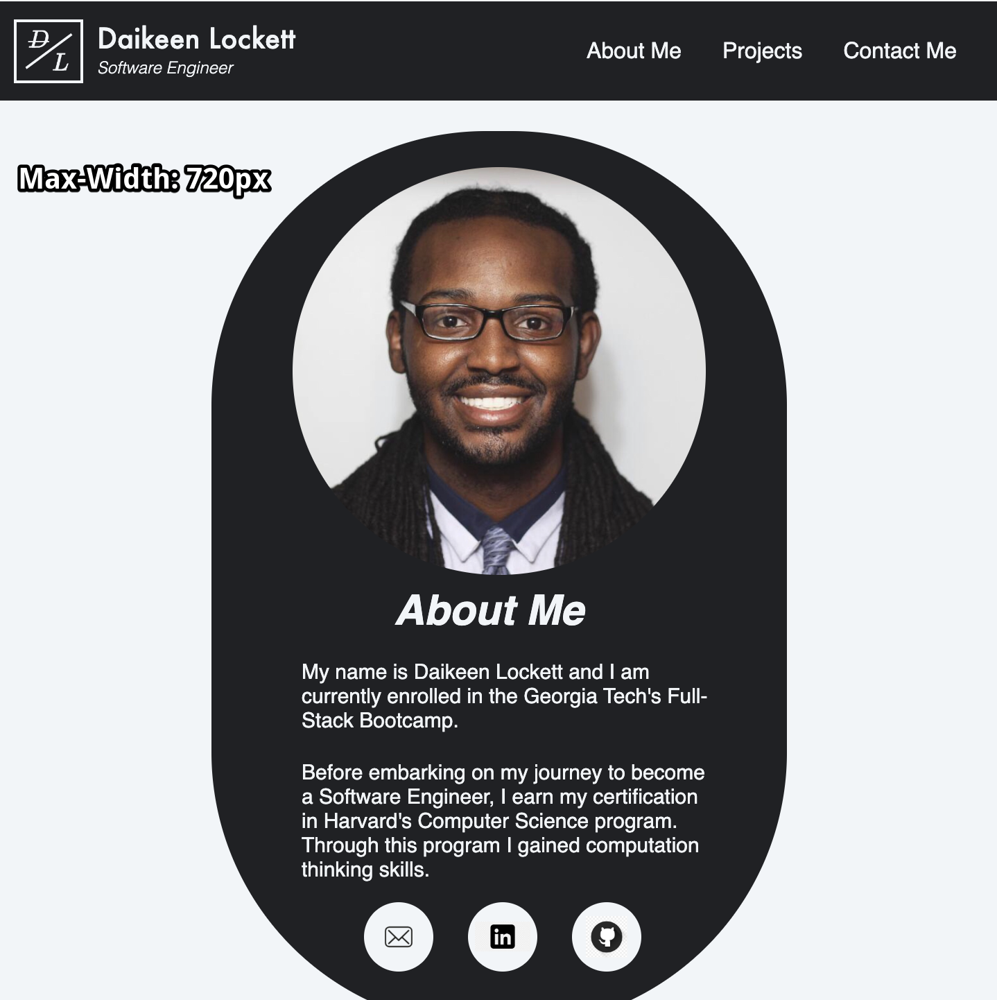

# my-portfolio

This is a portfolio website, whose purpose is to showcase my work and skills of being a software engineer.

## Description

My motivation for building this site was to showcase my projects while showcasing my 'bouncy/bubbly' personality. I knew that building a portfolio site is an important and essential asset for being a software engineer. This allows future employers to have a more detailed/transparent way to learn more about me and the work I have done, compared to a resume.

## Table of Contents (Optional)

If your README is long, add a table of contents to make it easy for users to find what they need.

- [Installation](#installation)
- [Usage](#usage)
- [Credits](#credits)
- [License](#license)

## Usage

Provide instructions and examples for use. Include screenshots as needed.

To add a screenshot, create an `assets/images` folder in your repository and upload your screenshot to it. Then, using the relative file path, add it to your README using the following syntax:

## Credits

List your collaborators, if any, with links to their GitHub profiles.

If you used any third-party assets that require attribution, list the creators with links to their primary web presence in this section.

If you followed tutorials, include links to those here as well.

## License

The last section of a high-quality README file is the license. This lets other developers know what they can and cannot do with your project. If you need help choosing a license, refer to [https://choosealicense.com/](https://choosealicense.com/).

---

## Features

If your project has a lot of features, list them here.
